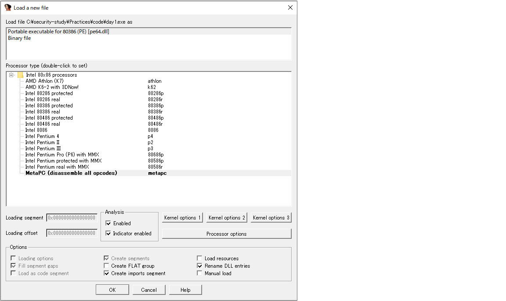

# バイナリ解析練習
## 1日目
- 解析対象の実行ファイル

```cpp
#include<iostream>
#include<vector>
using namespace std;

int main(){
    vector<int> arr;
    arr.push_back(5);

    cout << arr[0] << endl;

    return 0;    
}
```

- メインルーチンの逆アセンブル結果
```
; Attributes: bp-based frame fuzzy-sp

; int __cdecl main(int argc, const char **argv, const char **envp)
public _main
_main proc near

var_18= byte ptr -18h
var_C= dword ptr -0Ch
argc= dword ptr  8
argv= dword ptr  0Ch
envp= dword ptr  10h

lea     ecx, [esp+4]        ; ecx = esp+4
and     esp, 0 FF FF FF F0h ; esp && FF,FF,FF,F0(32bit=4byte) → 末尾の4bitは0
push    dword ptr [ecx-4]   ; ecx-4(=esp)をスタックの一番上へ, esp-4   
push    ebp                 ; ebpをスタックの一番上へ, esp-4
mov     ebp, esp            ; ebp = esp, ベースポインタをスタックの最先頭へ
push    ebx                 ; ebxをスタックの一番上へ, esp-4
push    ecx                 ; ecxをスタックの一番上へ, esp-4
sub     esp, 20h            ; esp = esp - 20h(32byte)
call    ___main             ; main関数の呼び出し
lea     eax, [ebp+var_18]
mov     ecx, eax
call    __ZNSt6vectorIiSaIiEEC1Ev ; std::vector<int,std::allocator<int>>::vector(void)
mov     [ebp+var_C], 5
lea     eax, [ebp+var_18]
lea     edx, [ebp+var_C]
mov     [esp], edx
mov     ecx, eax
call    __ZNSt6vectorIiSaIiEE9push_backEOi ; std::vector<int,std::allocator<int>>::push_back(int &&)
sub     esp, 4
lea     eax, [ebp+var_18]
mov     dword ptr [esp], 0
mov     ecx, eax
call    __ZNSt6vectorIiSaIiEEixEj ; std::vector<int,std::allocator<int>>::operator[](uint)
sub     esp, 4
mov     eax, [eax]
mov     [esp], eax
mov     ecx, offset __imp___ZSt4cout ; std::cout
call    __ZNSolsEi      ; std::ostream::operator<<(int)
sub     esp, 4
mov     dword ptr [esp], offset __ZSt4endlIcSt11char_traitsIcEERSt13basic_ostreamIT_T0_ES6_ ; std::endl<char,std::char_traits<char>>(std::basic_ostream<char,std::char_traits<char>> &)
mov     ecx, eax
call    __ZNSolsEPFRSoS_E ; std::ostream::operator<<(std::ostream & (*)(std::ostream &))
sub     esp, 4
mov     ebx, 0
lea     eax, [ebp+var_18]
mov     ecx, eax
call    __ZNSt6vectorIiSaIiEED1Ev ; std::vector<int,std::allocator<int>>::~vector()
mov     eax, ebx
jmp     short loc_4014AB
```

## 2日目
- 解析対象の実行ファイル
```cpp
int main(){
    int x = 1;
    int y;
    y = x;
    return 0;
}
```

- メインルーチンの逆アセンブル結果
```assembly
; Attributes: bp-based frame fuzzy-sp
    ; EBPベースのスタックフレームが利用されている。

; int __cdecl main(int argc, const char **argv, const char **envp)
    ; メイン関数の関数プロトタイプ
    ; __cdeclは、プログラムの規定の呼び出し規則である。
            引数はスタックで渡す
            func(a, b, c)なら引数はc, b, aの順にスタックに積まれる
            戻り値はEAXで受け取る
            引数の後始末は呼び出した側でする
            呼び出し前後で、EAX, ECX, EDXレジスタの値を変えていい
public _main
_main proc near

; ローカル変数
argc= dword ptr  8      ; argc, esp+8の箇所に存在する。 
argv= dword ptr  0Ch    ; argv, esp+12の箇所に存在する。
envp= dword ptr  10h    ; envp, esp+16の箇所に存在する。

push    ebp             ; ebpをpushし、esp-4となる。
mov     ebp, esp        ; ebp = esp
and     esp, 0FFFFFFF0h ; esp & 0xFFFFFFF0hは、下位4ビットが必ず0となる。これはスタックが16バイトごとの配置になるためそれに最適化する。
sub     esp, 10h        ; esp = esp - 16
call    ___main         ; __main関数の呼び出しで、リターンアドレスがスタックに追加される。esp-4となる。
                        ; push eipとmov eip JMP先のアドレスと同等
mov     dword ptr [esp+0Ch], 1  ; *(esp+12) = 1
mov     eax, [esp+0Ch]          ; eax = *(esp+12) = 1
mov     [esp+8], eax            ; *(esp+8) = eax = 1
mov     eax, 0                  ; eax = 0, これが戻り値となる。
leave                           ; mov esp, ebpとpop ebpと同等
retn                            ; pop xとmov eip xと同等
_main endp
```


## x日目
- 解析対象の実行ファイル

```cpp
```

- メインルーチンの逆アセンブル結果
```assembly
```

## IDA Proによる逆アセンブル方法
### 概要
    - IDA Proは逆アセンブラ兼デバッガで、マシンコードをアセンブリコードに変換する事が可能である。
    - デバッガも逆アセンブラであるが、動的コード解析を主としているか、静的コード解析を主としているかで用途が異なる。
    - なお、逆コンパイラはマシンコードを恒久言語に変換するプログラムである。

### IDA 逆アセンブラの使用方法
    - ファイルの読み込み
        - IDA freewareを開く。
        - "new"で対象の実行形式ファイルをエクスプローラーから選択する。
        - ファイルの読み込み方法をオプションから選択する。
            
